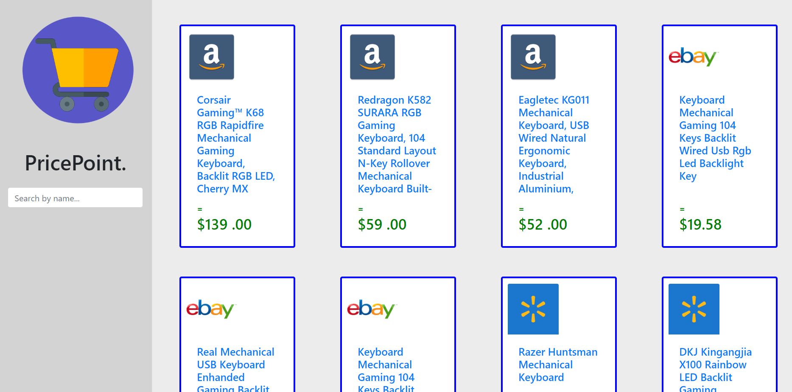

# PricePoint-StarterHacks2020

Languages Used: HTML, CSS, JavaScript
 
Tools: Handlebars.js, Bootstrap, Sheets.js, UI Path

## Inspiration

I remember how stressful it was last boxing day to find the best deal online. What made it more difficult is the vast number of e-commerce websites that offer the same products for multiple different prices. PricePoint eliminates the need to survey multiple websites, spending multiple hours in hopes to get the best deal.

## What it does

PricePoint retrieves data from multiple websites such as Amazon, eBay and Walmart based on the product the user specifies and elegantly displays the information on our own website. 

## How we built it
We scraped data from websites in an automated process using UIPath and retrieved and displayed data using an online website built on javascript, HTML, CSS, and bootstrap library. 

## Challenges we ran into
Connecting the information from the UIPath scraping to the website itself posed as a problem that we overcame through learning about JSON libraries and lists of objects. Furthermore, retrieving the information itself using UIPath required us to build a solid understanding of UIPath and displaying the information in a pleasant way was overcome through using handeler.js and card views. 

## Accomplishments that we're proud of
Being able to connect the components of the project from the UIPath to the website was a major accomplishment along with creating an intuitive user interface and which provided the found data to users. 

## What we learned
We built upon our knowledge of web development and learned automation through the use of UIPath API. 

## What's next for PricePoint
We would like to focus on incorporating the UIPath API directly into the website and further developing the data scraped and overall user experience.

Here is a YouTube video that shows a demo: https://youtu.be/H_j5QMsm1-w

Here is a screen shot of out web application:

